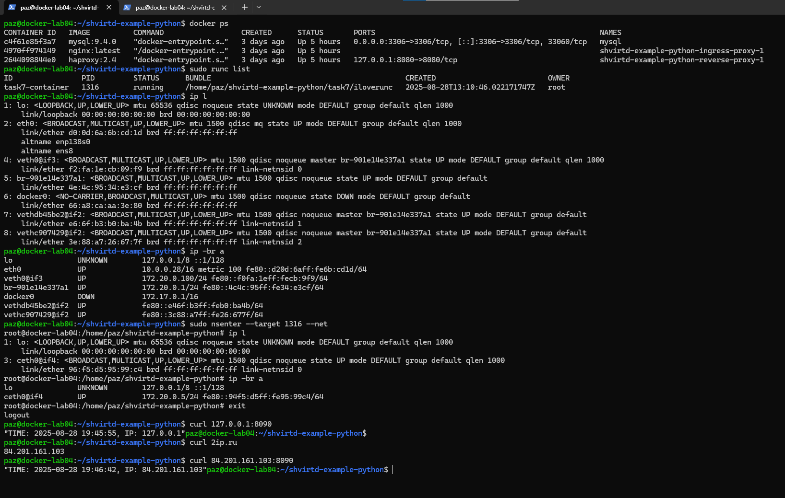

## Задача 7 (***)
Запустите ваше python-приложение с помощью runC, не используя docker или containerd.  
Предоставьте скриншоты  действий 

Первое что приходит в голову это использовать аналогичный путь как и при смене root. 
То есть все мы меняли или переустанавливали grub, поэтому попробуем пойти этим путём.

1. Создадим папку mkdir -p iloverunc/rootfs
2. Создадим минимально необходимую стркутуру каталогов нашего контейнера
``` 
cd iloverunc/rootfs
mkdir -p ./{bin,dev,proc,sys,etc,usr,lib,tmp,var} 
```
3. Монтируем системные каталоги
однострочником ``` for i in dev proc sys; do sudo mount --bind /$i ./rootfs/$i; done ```

4. Проверяем зависимости нашего командного интерпретатора ```/bin/bash```
вот этой командой 
``` ldd rootfs/bin/bash ```

в выводе получаем следующее
```
        linux-vdso.so.1 (0x00007fffbb5c9000)
        libtinfo.so.6 => /lib/x86_64-linux-gnu/libtinfo.so.6 (0x000078436d5bd000)
        libc.so.6 => /lib/x86_64-linux-gnu/libc.so.6 (0x000078436d200000)
        /lib64/ld-linux-x86-64.so.2 (0x000078436d765000)
```

Создаём необходимую структуру и подкидываем необходимые библиотеки вот таким однострочником:
```
for i in apt ls ps mount; do which $i | xargs -I {} sh -c "sudo cp {} rootfs/bin/ && ldd {} |grep '=> /' |cut -d ' ' -f 3 | xargs -I {} sudo cp --paren
ts {} rootfs/"; done ```

и делаем **chroot** c последующей установкой необходимых программ
``` chroot ./   /bin/bash -c "apt update && apt install -y python3 pip && apt clean" ```

И конечно получаем что-то в виде такого: ``` E: Error reading the CPU table```
А всё дело в том, что Debian-бинарники завязаны на свою файловую базу. 
apt и dpkg — не «статические исполняшки», а фронтенды над огромным слоем данных и скриптов. Вручную вытаскивать всё = практически пересобрать мини-Debian руками. 

Вот что выдаст нам **strace**: запущенный внутри контейнера для  команды apt```
newfstatat(AT_FDCWD, "/etc/apt/apt.conf", 0x7ffc0bd03cb0, 0) = -1 ENOENT (No such file or directory)
ioctl(0, TCGETS, {c_iflag=ICRNL|IXON, c_oflag=NL0|CR0|TAB0|BS0|VT0|FF0|OPOST|ONLCR, c_cflag=B38400|CS8|CREAD, c_lflag=ISIG|ICANON|ECHO|ECHOE|ECHOK|IEXTEN|ECHOCTL|ECHOKE, ...}) = 0
newfstatat(AT_FDCWD, "/var/lib/dpkg/status", 0x7ffc0bd03c80, 0) = -1 ENOENT (No such file or directory)
newfstatat(AT_FDCWD, "/usr/bin/dpkg", 0x7ffc0bd03c80, 0) = -1 ENOENT (No such file or directory)
newfstatat(AT_FDCWD, "/etc/debian_version", {st_mode=S_IFREG|0644, st_size=13, ...}, 0) = 0
openat(AT_FDCWD, "/usr/share/dpkg/cputable", O_RDONLY) = -1 ENOENT (No such file or directory)
write(2, "\33[1;31m", 7)                = 7
write(2, "E", 1E)                        = 1
write(2, ": ", 2: )                       = 2
write(2, "\33[0m", 4)                   = 4
write(2, "Error reading the CPU table", 27Error reading the CPU table) = 27
write(2, "\33[0m", 4)                   = 4
write(2, "\n", 1
)                       = 1
close(3)                                = 0
exit_group(100)                         = ?
+++ exited with 100 +++   ```

То есть у нас нет базы dpkg ракетов. Стоит ли говорить, что даже подброс этой базы не решит всех вопросов. Останутся ещё всякие **/etc/dpkg**, **/etc/os-release**, **/etc/debian_version** **gpg и его keyrings**... 

Контейнер, (конечно это не контейнр, по сути сменили root), запустился, полезной нагрузкой мы его не можем озадачить. Слишком долго будем приводить его в рабочее состояние.Но, как всегда, люди давно решили эту задачу. Решение называется debootstrap.
Вот что о нём написано на сайте deian.org:

> debootstrap это инструмент, который может установить базовую систему Debian в подкаталог другой, уже установленной системы. Он не требует инсталляционного CD и просто получает доступ к репозиторию Debian. Он может также устанавливаться и управляться из другой операционной системы, таким образом, например, Вы можете использовать debootstrap, чтобы установить Debian на неиспользованный раздел из запущенной Gentoo системы. Он может также используется для создания rootfs для машин различной архитектуры
Из этой микрозаметки https://wiki.debian.org/Debootstrap


Наша цель установиь в нашу папку rootfs этот debootstrap. Делается это командой: ``` debootstrap stable ./rootfs http://deb.debian.org/debian/```  (я часто опускаю sudo в командах, как и в этот раз)

Ждём распоковки.
На выходе получаем 300 Мегабайт отборных бинарников, скриптов и всяких конфигурационных файлов.

Ну и снова прикручиваем необходимые папки и "заходим" в него:
```
for i in dev proc sys; do sudo mount --bind /$i rootfs/$i; done
chroot rootfs/
```
Вот теперь совсем другое дело! Программ много, всё работает. И даже сеть!
Но опять стоит упомянуть, это не контейнер! **chroot** только меняет корень ```(/)```, сеть и всё остальное общее с хостом. Нет изоляции как у контейнера. Мы дальше вернемся к нему, изолировав сеть в своём namespace.

###runc
Создание нового конфигурационного файла для runc
```runc spec```

После завершения работы команды мы должны получить дефолтный конфигурационный файл config.json
Он уже готов к использованию, что стоит в нём изменить это:
а) убрать network namespace (так мы не будем создавать свой namespace и сразу сможем воспользоваться сетью хоста)
б) process -> args задать bash вместо sh
в) root -> readonly задать false 

Совершив эти манипуляции, старуем наш контейнер ``` runc run task7-container ```
после чего мы должны оказаться внутри нашего контейнера.

Вот эта статья прям очень сильно помогла всё это настроить и понять 
https://blog.quarkslab.com/digging-into-runtimes-runc.html
или её сокращённый русский перевод
https://habr.com/ru/companies/selectel/articles/316258/

А как запустить контейнер "в фоне", не в интерактивном режиме. При запуске контейнера он цепляет свой tty к твоему терминалу и запуск контейнера ```runc run -d task7-container``` в данном случае ничего не изменит. Дело в том, что при запуске он не будет знать куда деть ему свой tty, к чему его зацепить и упадёт с ошибкой
> ERRO[0000] runc run failed: cannot allocate tty if runc will detach without setting console socket

Это можно обойти или создавая сокет и передавая его в контейнер или отключив совсем tty. Для этого в нашем config.json делаем так:
```
"process": {
    "terminal": false,
    "args": ["sleep", "infinity"]
}
```
Вместо bash у нас теперь sleep и infinity, это чтобы что-то крутилось в нём и контейнер "жил".

Теперь при запуске контейнера мы его увидимим в списке контейнеров и сможем после этого подключиться к нему:
```
runc run -d task7-container
runc list
runc exec task7-container bash
```


А теперь сеть. 
Ранее мы убрали из конфига требование создавать для контейнера свой namespace для сети. Теперь вернём всё назад.
``` linux -> namespaces -> { "type": "network" } ```

Теперь создаём виртуальную пару интерфейсов:
```
ip link add veth0 type veth peer name ceth0
ip link set veth0 up
ip addr add 172.20.0.100/24 dev veth0
```
и прикручиваем конец в наш контейнер
```ip link set ceth0 netns /proc/21916/ns/net```

Да, PID процесса можно узнать у runc (заметь запускаю из-под sudo, так как сижу не под root):
```
sudo runc list
ID                PID         STATUS      BUNDLE                                             CREATED                          OWNER
task7-container   21916       running     /home/paz/shvirtd-example-python/task7/iloverunc   2025-08-28T09:16:30.914258993Z   root
```

По умолчанию runc запускает контейнер с жёстко ограниченными capability. Чтобы делать сетевые операции (поднимать интерфейсы, менять адреса, маршруты) ИЗ САМОГО КОНТЕЙНЕРА нужны capability:
**"CAP_NET_RAW" "CAP_NET_ADMIN"**
Да, вносим изменения в наш конфиг и снова все перезапускаем и перенастраиваем :)
Но, есть путь и проще, мы можем отредактировать нашу сеть из хоста. Надо понимать, что это из контейнера всё выглядит закрытым и недоступным, для хоста все эти ширмы - фигов листочек. ``` sudo nsenter --target 21916 --net ```  и мы можем редактировать наши сетевые настройки.

И так, мы внутри:
```
ip link set ceth0 up
ip addr add 172.20.0.5/24 dev ceth0
ping -c 1 172.20.0.100
ip route add default via 172.20.0.1 dev ceth0
```

Отключаемся от контейнера. Теперь проброс трафика во-вне. На хостовой машине
```
echo 1 > /proc/sys/net/ipv4/ip_forward
iptables -t nat -A POSTROUTING -s 172.20.0.0/24 -j MASQUERADE
```

Ну и добавляем DNS
Внутри контейнера:
```echo "nameserver 8.8.8.8" > /etc/resolv.conf ```
Этого достаточно чтобы контейнер смотрел во-вне и мог что-то у себя установить.


Например:
```
apt update
apt install python3
apt install pip
```

После установки необходимых пакетов и настройки окружения, добиваем сеть. По условию задачи, наш python должен видеть mysql, для этого помещаем их в одну сеть.
Поднимаем наш docker compose без web сервера и смотрим как называется мост который появился у нас в сети.
Ну а далее подключаем наш veth0 в этот мост ```sudo ip link set veth0 master br-901e14e337a1```

В принципе этого должно быть достаточно чтобы контейнеры могли видеть друг друга.

Руками инициализируем переменные окружения, которые используем в python коде
```
export DB_HOST=172.20.0.10
export DB_USER=app
export DB_PASSWORD=QwErTy1234
export DB_NAME=virtd
```

Запускаем проект руками из контейнера:
```
python3 -m venv task7-env
source task7-env/bin/activate
uvicorn main:app --host 0.0.0.0 --port 5000 --reload
```

Из другого терминала цепляемся ```curl  127.0.0.1:8090```


## Итог

**Автоматизация:**

За исходник взять готовый образ docker-python, это сильно упростило бы мне жизнь.
Для того чтобы настроить сеть в runc нужно использовать hooks (poststart). Фактически всё, что мы делали руками перенести в bash скрипт и запускать его в hook.
Тоже касаемо подключения к сети docker. Можно подцепиться к мосту, но правильнее было залезть в тот же namespace.
Переменные окружения закидывать через шаринг общего каталога.




